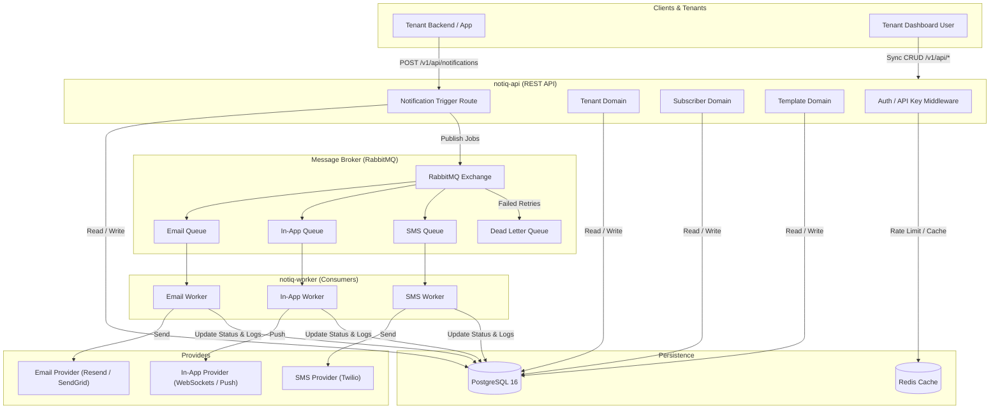

# Notiq 🔔

**Notiq** is a high-performance, multi-tenant notification engine built with **Bun**, **TypeScript**, **PostgreSQL**, **RabbitMQ**, and **Redis**. Designed with Clean Architecture and Domain-Driven Design (DDD) principles, Notiq provides a scalable background delivery system for multi-channel notifications (Email, In-App, SMS).

---

## 📌 Architecture & System Overview

Notiq decouples synchronous tenant management requests from asynchronous, high-volume notification delivery using event-driven microservices.



---

## 🛠 Tech Stack

| Component | Technology | Purpose |
| :--- | :--- | :--- |
| **Runtime** | [Bun](https://bun.sh/) | Fast all-in-one JavaScript runtime & package manager |
| **Language** | [TypeScript](https://www.typescriptlang.org/) | Type safety across domain entities & API contracts |
| **API Framework** | [Express.js](https://expressjs.com/) | REST API server with custom async route handlers |
| **Database** | [PostgreSQL 16](https://www.postgresql.org/) | Relational store for tenants, templates, subscribers, and logs |
| **Migration Tool** | [Knex.js](https://knexjs.org/) | Schema migrations and query builder |
| **Message Broker** | [RabbitMQ 3](https://www.rabbitmq.com/) | Reliable AMQP queue for asynchronous message processing |
| **Cache & Lock** | [Redis 7](https://redis.io/) | Fast cache and rate-limiting store |
| **Containerization** | [Docker Compose](https://www.docker.com/) | Local multi-container development environment |

---

## 📂 Services Breakdown

Notiq is structured as a light monorepo separated into microservices under the [`./services`](./services) directory:

### 1. `notiq-api` ([`./services/notiq-api`](./services/notiq-api))
The synchronous HTTP API handling tenant operations, template management, subscriber preferences, and notification dispatch requests.

* **Architecture Pattern**: Clean Architecture / Domain-Driven Design (DDD).
  * **Domain Layer** ([`./services/notiq-api/src/domain`](./services/notiq-api/src/domain)): Aggregates, Entities, Value Objects, Domain Events, and Repository Interfaces.
  * **Application Layer**: Use Cases and DTOs.
  * **Infrastructure Layer** ([`./services/notiq-api/src/infra`](./services/notiq-api/src/infra)): Database Repositories (Knex), HTTP Controllers, Route Definitions, Middlewares, and RabbitMQ Producers.
* **Responsibilities**:
  * Tenant signup, authentication, and API key generation.
  * CRUD for subscribers and channel routing preferences.
  * Template management with variable placeholder definition.
  * Validating & enqueueing notification jobs to RabbitMQ.

### 2. `notiq-worker` ([`./services/notiq-worker`](./services/notiq-worker))
The asynchronous background worker service responsible for consuming notification jobs from RabbitMQ and executing delivery.

* **Responsibilities**:
  * Consuming messages from channel-specific queues (`email_queue`, `in_app_queue`, `sms_queue`).
  * Rendering message templates with provided payload variables.
  * Dispatching messages via provider adapters.
  * Recording delivery status updates and logs into PostgreSQL (`notifications_log`).
  * Routing unrecoverable failures to the Dead Letter Queue (`DLQ`).

---

## 🗄 Database Schema

The database schema enforces multi-tenant data isolation, template versioning, subscriber channel mapping, and audit logging.

```
                      +-------------------+
                      |      tenants      |
                      +-------------------+
                               | 1
                               |
              +----------------+----------------+
              | *                               | *
    +-------------------+             +-------------------+
    |    tenant_api     |             |    subscribers    |
    +-------------------+             +-------------------+
                                                | 1
                                                |
                                                | *
                                      +-------------------+
                                      | subscriber_channels|
                                      +-------------------+

                      +-------------------+
                      |     templates     |
                      +-------------------+
                               | 1
                               |
                               | *
                      +-------------------+
                      |template_variables |
                      +-------------------+

                      +-------------------+
                      |   notifications   |
                      +-------------------+
                               | 1
                               |
                               | *
                      +-------------------+
                      | notifications_log |
                      +-------------------+
```

### Table Definitions

1. **`tenants`**: Registered system users/organizations (supports soft deletes via `deleted_at`).
2. **`tenant_api`**: API keys mapped to tenants for authenticating programmatic requests.
3. **`subscribers`**: End-users who receive notifications, scoped per tenant.
4. **`subscriber_channels`**: Channel preferences per subscriber (`email`, `in_app`, `sms`) with target addresses/handles.
5. **`templates`**: Notification templates created by tenants with channel assignment (`email`, `in_app`, `sms`).
6. **`template_variables`**: Dynamic variables required for template compilation (e.g., `{{user_name}}`, `{{otp_code}}`).
7. **`notifications`**: Main notification requests dispatched by tenants. Statuses: `queued`, `processing`, `delivered`, `failed`.
8. **`notifications_log`**: Historical delivery lifecycle events and retry records.

---

## 📡 API Specification & System Design

### 🔑 Authentication & Tenants
* `POST /v1/api/auth/register` - Tenant registration. Returns JWT and tenant record.
* `POST /v1/api/auth/login` - Tenant login. Returns JWT token.
* `GET /v1/api/tenants` - List all tenants (paginated).
* `GET /v1/api/tenants/:id` - Fetch tenant details.
* `DELETE /v1/api/tenants/:id` - Soft delete tenant account.

### 👤 Subscribers
* `POST /v1/api/subscribers` - Create subscriber with channel preferences (e.g. `{ email: "user@example.com", in_app: true }`).
* `GET /v1/api/subscribers` - List subscribers per tenant.
* `GET /v1/api/subscribers/:id` - Get subscriber profile & channels.
* `PATCH /v1/api/subscribers/:id` - Update subscriber details/channels.
* `DELETE /v1/api/subscribers/:id` - Remove subscriber.

### 📑 Templates
* `POST /v1/api/templates` - Create notification template with subject and body variables.
* `GET /v1/api/templates` - List templates filtered by channel (`email`, `in_app`, `sms`).
* `GET /v1/api/templates/:id` - Get template definition.
* `PATCH /v1/api/templates/:id` - Update template subject/body/variables.
* `DELETE /v1/api/templates/:id` - Delete template.

### 🚀 Notifications (Async Dispatch)
* `POST /v1/api/notifications` - Send notification request.
  ```json
  {
    "subscriber_id": "uuid",
    "template_id": "uuid",
    "channels": ["email", "in-app"],
    "data": {
      "user_name": "Alex",
      "action_url": "https://example.com/verify"
    }
  }
  ```
  **Response**: `202 Accepted`
  ```json
  {
    "notification_id": "uuid",
    "status": "queued"
  }
  ```
* `GET /v1/api/notifications` - Query notification delivery history & pagination.
* `GET /v1/api/notifications/:id` - Retrieve delivery logs & current status for a notification.

---

## 🚀 Getting Started & Local Development

### Prerequisites
* [Bun](https://bun.sh/) (v1.3+ recommended)
* [Docker & Docker Compose](https://www.docker.com/)

### 1. Environment Setup
Copy the example environment file and update credentials if needed:
```bash
cp .env.example .env
```

### 2. Start Infrastructure Services
Boot PostgreSQL, RabbitMQ, and Redis using Docker Compose:
```bash
docker-compose up -d postgres rabbitmq redis
```

* **PostgreSQL**: `localhost:5432`
* **RabbitMQ AMQP**: `localhost:5672`
* **RabbitMQ Management Dashboard**: [http://localhost:15672](http://localhost:15672) (User & Password configured in `.env`)
* **Redis**: `localhost:6379`

### 3. Run Database Migrations
Migrations are managed in `notiq-api`. Run migrations against Postgres:
```bash
cd services/notiq-api
bun run knex migrate:latest --knexfile knexfile.ts
```

### 4. Running Services Locally

#### Start `notiq-api` (Dev mode with auto-reload)
```bash
cd services/notiq-api
bun dev
```
*API will run on [http://localhost:3000](http://localhost:3000)*

#### Start `notiq-worker` (Dev mode with auto-reload)
```bash
cd services/notiq-worker
bun dev
```

#### Run All Services via Docker Compose
To build and run the entire stack (API, Worker, DB, Queue) inside containers:
```bash
docker-compose up --build
```

---

## 🎯 Project Roadmap & Future Directions

This section outlines the planned development trajectory based on the system design specification:

- [x] **Core Foundation**: Bun setup, Docker Compose environment, database connection, Knex migrations.
- [x] **Tenant DDD Domain**: Domain Entity, Value Objects (Password, API Key), Repository, Use Cases, Controllers & Routes.
- [ ] **Authentication & Security**: JWT Auth middleware, Tenant API Key authorization header parsing.
- [ ] **Subscriber Domain**: Complete Subscriber CRUD, channel validation, and subscriber preference storage.
- [ ] **Template Engine**: Template CRUD, template variable extraction, string interpolation parser.
- [ ] **Queue Producer Integration**: RabbitMQ Exchange publisher in `notiq-api` for `POST /v1/api/notifications`.
- [ ] **Worker Consumers & Channel Handlers**:
  - [ ] **Email Consumer**: Integration with Resend / SendGrid / Nodemailer API.
  - [ ] **In-App Consumer**: Storage in in-app message inbox table & WebSocket push event emit.
  - [ ] **SMS Consumer**: Integration with Twilio API.
- [ ] **Resilience & DLQ Handling**:
  - Exponential backoff retry logic for transient provider network errors.
  - Dead Letter Queue consumer & dashboard for failed job inspection.
- [ ] **Delivery Analytics & Logging**: Live status logging (`queued` ➔ `processing` ➔ `delivered` / `failed`) accessible via `GET /v1/api/notifications/:id`.
- [ ] **Non-Functional Requirements**:
  - 99.9% uptime architecture.
  - Sub-5-second notification delivery SLA.
  - Idempotent delivery protection (at-least-once with subscriber deduplication).

---

## 📝 Documentation Note

This project is a personal multi-tenant notification system workspace. All technical documentation, system design flows, schema definitions, and development notes are centralized in this single `README.md` to keep maintenance simple and effective.
